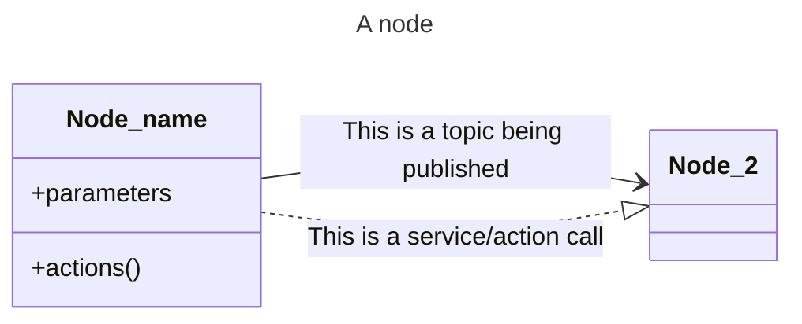
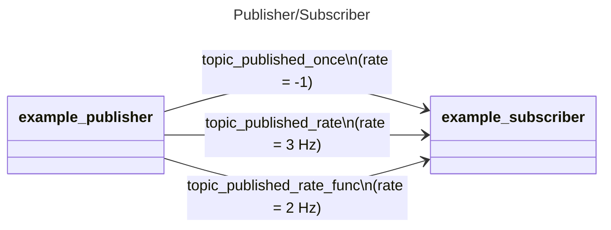
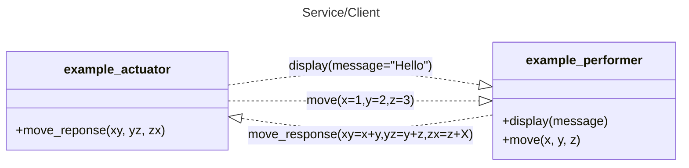
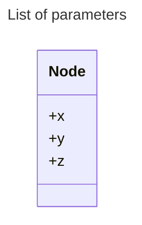
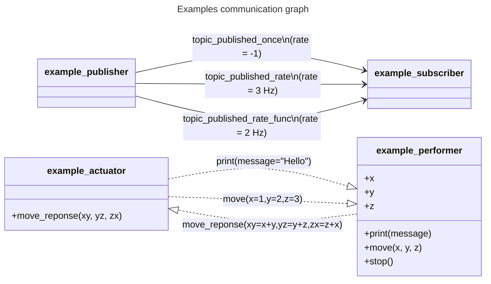

# AXONE

[](https://github.com/PYBrulin/axone/actions/workflows/pywheels.yaml)

Axone is a ROS-like framework for distributed computing on a single system implemented in pure-Python. It is designed to be used in a multi-process environment by using a shared memory for communication between nodes. No outside communication is supported at this time.

The package provide basic functionalities similar to ROS, such as:

- Publisher/Subscriber: A node can publish data to a topic, and other nodes can subscribe to this topic to receive the data.
- Service/Client: A node can provide a service, and other nodes can call this service.
- Parameter server: A node can store parameters on the parameter server, and other nodes can retrieve them.

## Installation

Axone can be installed locally using pip:

```bash
pip install -e .
```

or using the provided wheel in the release section:

```bash
pip install axone-0.1.0-py3-none-any.whl
```

## Usage



### Shared memory

Axone uses shared memory to communicate between nodes. A shared memory is created by the first node that uses it, and it is accessible by all nodes that use the same name.

The shared memory is identified by a name, and the size of the shared memory must be specified when creating it. The size of the shared memory is commonly a power of 2.

To handle concurrent access to the shared memory, Axone relies on a file lock to ensure that only one process can access the shared memory at a time. The file lock creation is handled by the cross-platform package `filelock` which is the only dependency of this project.

For more information on shared memory, see the [Python documentation](https://docs.python.org/3/library/multiprocessing.shared_memory.html).

```python
from axone.node import Node

node = Node(
    name="example_node", # Name of the node
    memory_endpoint="ExampleNodeMemory", # Name of the shared memory
    memory_size=4096, # Size of the shared memory
)
```

Note that for multiple nodes, it is also possible to load the network configuration from a file using the `load_network` method of the `Node` class. The method takes the path to the network configuration file as an argument. The network configuration file must be a JSON file with the following structure:

The JSON file defining the network configuration. Only the `memory_endpoint` and `memory_size` keys are required.

```json
{
  "memory_endpoint": "ExampleNodeMemory",
  "memory_size": 8192
}
```

The Python code to load the network configuration from the JSON file.

```python
from axone.node import Node

node = Node(
    name="example_node", # Name of the node
    config_file="axone.json", # The above JSON file
)
```

### Publisher/Subscriber



A publisher can be created using the `publish` or `publish_once` method of a node. The method takes the name of the topic to publish to, and the data to publish. It is possible to pass a function as the message, in which case the function will be called at the rate specified by the `rate` argument. The function must return a JSON-serializable object as the message.

```python
from axone.node import Node

node = Node(
    name="example_publisher",
    memory_endpoint="ExampleNodeMemory",
    memory_size=4096,
)
node.publish_once(
    "topic_published_once",
    message={"data": f"Hello from topic_published_once"},
    rate=1,
)
```

A subscriber can be created using the `subscribe` method of a node. The method takes the name of the topic to subscribe to, and a callable callback function that will be called when a message is received. The callback function must take a single argument, which will be the received message. Parsing of the message should be handled by the callback function.

```python
from axone.node import Node

node = Node(
    name="example_subscriber",
    memory_endpoint="ExampleNodeMemory",
    memory_size=4096,
)

def callback(message):
    print(f"Raw object: {message}")
    print(f"Data within: {message.get('data')}")

node.register_subscribe("topic_published_once", callback=callback)
```

### Service/Client



A list of actions or services can be registered by a node during initialization. The list of services is passed as a dictionary to the `actions` argument of the `Node` constructor. The dictionary must have the service name as the key or be passed a callable function directly. The value of each key must be a dictionary with the name of the arguments as the key and the type of the argument as the value. The callable function must take a single argument, which will be the request message.

```python
from axone.node import Node

def display(message):
    print(f"Message: {message.get('message')}")

def move(message):
    print(
        f"Moving to: {message.get('x')}, {message.get('y')}, {message.get('z')}"
    )

node = Node(
    name="example_performer",
    memory_endpoint="ExampleNodeMemory",
    memory_size=4096,
    actions={
        display: {
            "message": "str",
        },
        move: {
            "x": "float",
            "y": "float",
            "z": "float",
        },
    },
)
```

A service can be called using the `call_action` method of a node. The method takes the name of the service to call, the name of the action to call, and the arguments to pass to the action directly as keyword arguments.

```python
from axone.node import Node

node = Node(
    name="example_actuator",
    memory_endpoint="ExampleNodeMemory",
    memory_size=4096,
)
node.call_action(dest_node=target_node, action="move", x=1, y=2, z=3)
```

An answer can be returned by a service, but is not required. The answer must be a JSON-serializable object.
If an answer is expected, the argument `answer` can be passed to the `call_action` method.
The `answer` argument accept either a string matching the action name, or directly the callable function to call. The callable function must already be registered as an action on the client node and must take the same arguments as the response message will have. On the service side, the answer will be returned on the service named after `answer`. If no `answer` argument is passed, but the service still returns an answer, the answer will be ignored. For an example of this, see the `example_actuator` and `example_performer` nodes in the `examples` folder which implement a simple request/response service over the request `move` and the response `move_response`.

### Parameter server



A parameter list can be exposed by a node during the node initialization. The list of parameters is passed as a dictionary to the `parameters` argument of the `Node` constructor. The dictionary must have the parameter name as the key and the value of the parameter as the value. The value of each key must be a JSON-serializable object.

These parameters are read-only and cannot be modified by external node. If a behavior is expected to perform changes to the parameters, it should be implemented as a service.

```python
from axone.node import Node

x = y = z = 0
node = Node(
    name="example_performer",
    memory_endpoint="ExampleNodeMemory",
    memory_size=4096,
    parameters={
        "x": x,
        "y": y,
        "z": z,
    },
)
```

### Examples

The `examples` folder contains a few examples of nodes that can be run using the `axone` command.
When running all `example_*.py` files, the following communication graph is created:


