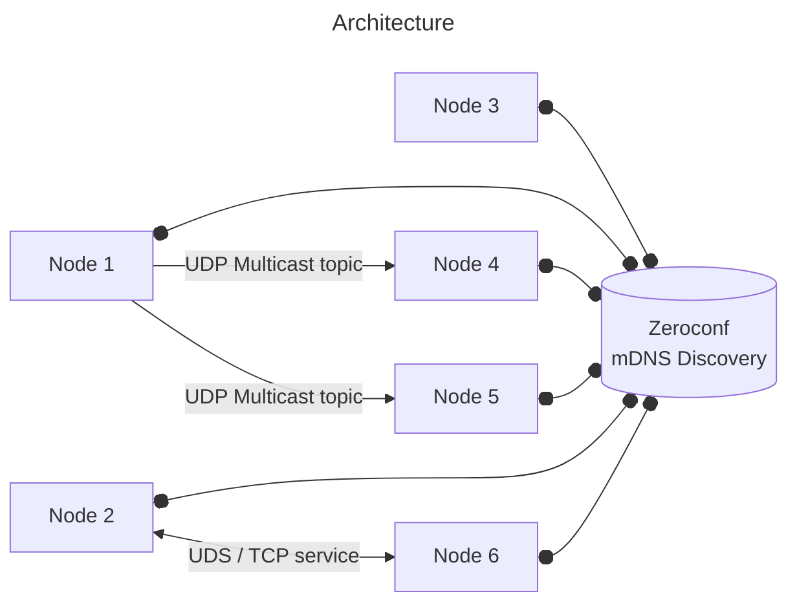
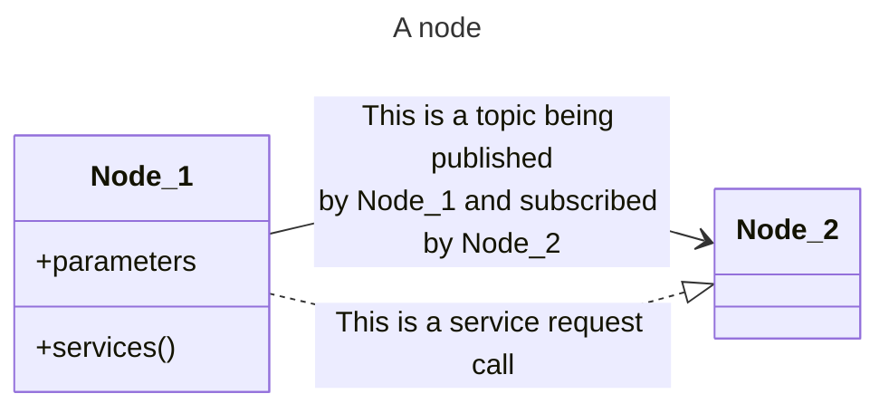
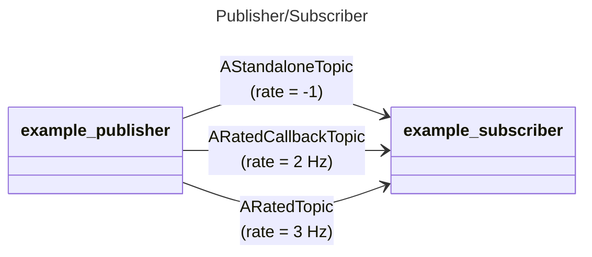
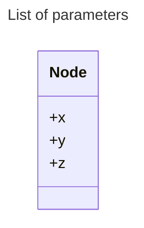
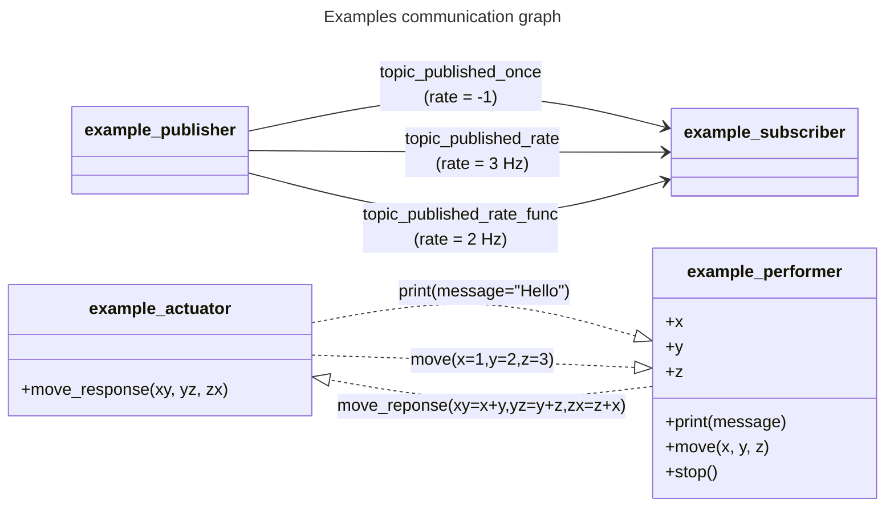
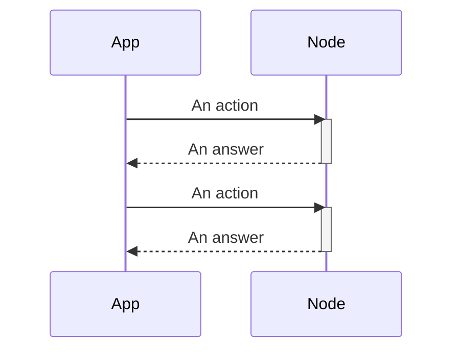
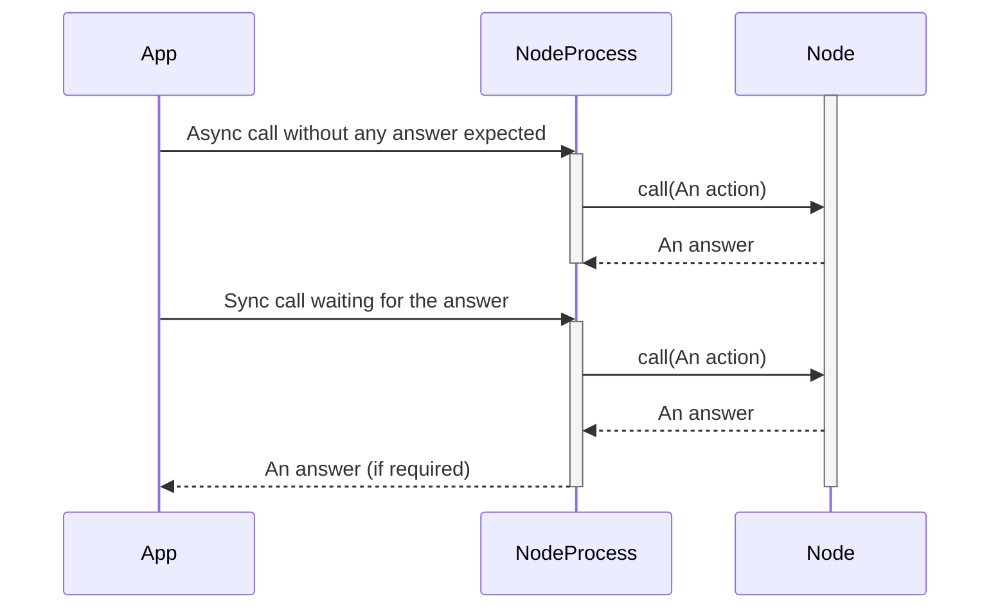

# AXONE

<a href="https://www.python.org/downloads/release/python-3100/"></a>

[](https://github.com/PYBrulin/axone/actions/workflows/pywheels.yaml)

Axone is a ROS-like framework for process communication on a local system/network implemented in pure-Python. It is designed to be used in a multi-process environment by using **UDP multicast sockets** for topic communication and **Unix domain sockets** (or TCP on Windows) for service calls. Node discovery is handled transparently through **Zeroconf/mDNS**, making the system fully decentralized with no central coordinator required.
The package is designed to be lightweight and easy to use, making it suitable for various applications, including robotics, data processing, and distributed systems.

The package provides basic functionalities similar to ROS, such as:

- **Publisher/Subscriber**: A node can publish data to a topic, and other nodes can subscribe to this topic to receive the data.
- **Service/Client**: A node can provide a service, and other nodes can call this service.
<!-- - **Parameter Server (WIP)**: A node can store parameters on the parameter server, and other nodes can retrieve them. -->

Shared memory was the first transport supported in this work. While it has genuine appeal — low latency, zero network stack overhead, and data that never leaves the machine — it comes with a fragility that is hard to contain in production: shared memory blocks are kernel-managed resources that persist until explicitly unlinked, so a crash or incomplete shutdown leaves stale segments behind. These orphaned blocks accumulate silently across runs, consume address space, and can cause subsequent node startups to fail or read stale data. UDP multicast sockets were adopted as the primary method in response to these problems. Sockets carry none of this state: when a process exits, its socket closes, and no trace remains. They are also more flexible, extending naturally to multi-machine deployments without any configuration change. As of today, the socket method is the default and recommended approach; shared memory remains available as an opt-in alternative for single-machine setups where its constraints are fully understood.

The package name comes from the word 'axon':

> axon, portion of a nerve cell (neuron) that carries nerve impulses away from the cell body. A neuron typically has one axon that connects it with other neurons or with muscle or gland cells.
>
> Britannica, The Editors of Encyclopaedia. "axon". Encyclopedia Britannica, 6 May. 2024, https://www.britannica.com/science/axon.

## Installation

Axone can be installed locally using pip:

```bash
pip install -e .
```

Alternatively, you can use the provided wheel in the [release](https://github.com/PYBrulin/axone/releases) section:

```bash
pip install axone-[latest-version]-py3-none-any.whl
```

## Decentralized Architecture

Axone nodes discover each other through **Zeroconf/mDNS** without any central coordinator. When a publisher is created it registers a `_axone._udp.local.` service entry advertising its multicast group, port, and publication rate. When a service server starts it registers a `_axone._tcp.local.` entry. Subscribers and service clients browse these entries and connect directly, so adding or removing a node at runtime is handled automatically.

- **Topic data** flows over **UDP multicast** sockets. Each topic is assigned its own port within a configurable range and a multicast group address (defaulting to `239.255.0.1` on loopback, `224.1.1.1` on other interfaces). Publishers send serialized `AxoneStruct` messages to the group; all subscribers that joined the group receive them.
- **Service calls** flow over **Unix domain sockets** on Linux/macOS (files under `/tmp/`) or **TCP** on Windows. The connection endpoint is advertised via Zeroconf so that any node on the network can locate and call a service by name.




## Usage



### Node Initialization

```python
from axone.node import AxoneNode

node = AxoneNode(
    name="example_node",
    default_publisher_interface="lo",           # Network interface used by publishers
    default_publisher_address="239.255.0.1",    # Multicast group address
    default_publisher_port_range=(45001, 50000),  # Port range for topic sockets
)
```

You can also load the network configuration from a JSON file using the `config_file` argument:

```json
{
  "default_publisher_port_range": [45001, 50000],
  "default_publisher_interface": "lo",
  "default_publisher_address": "239.255.0.1",
  "method": "socket"
}
```

```python
node = AxoneNode(
    name="example_node",
    config_file="axone.json",  # Path to the JSON configuration file
)
```

An optional symmetric encryption key can be provided so that all messages on the network are encrypted transparently:

```python
from axone.encryption import generate_encryption_key

key = generate_encryption_key()  # Save and share this key among trusted nodes
node = AxoneNode(name="example_node", encryption_key=key)
```

### AxoneStruct

`AxoneStruct` objects are serializable structures that can be passed between nodes. They behave like dictionaries and ensure compatibility for inter-process communication. Each field type is encoded in a compact binary format so that messages stay small over the wire.

```python
from axone.axone_struct import AxoneStruct

class SubMessage(AxoneStruct):
    x: int = 0
    y: float = 1.2
    z: str = "34"

class ATopicPassedToAxone(AxoneStruct):
    a: bool = True
    b: int = 0
    c: int = 1
    d: int = 2
    e: float = 1.23456789
    f: float = 1e9
    g: float = 0.00001357
    h: str = "hello"
    time: float = time.time  # Callable whose return value is stored
    xyz: SubMessage = SubMessage()
```

### Publisher/Subscriber



#### Publisher

A publisher can be created using the `publish_rate` or `publish_once` methods of a node. Publishers can send data at a specified rate or just once.

It is possible to pass a function as the message, in which case the function will be called at the rate specified by the `rate` argument. The function must return a subclass of an `AxoneStruct` object, which acts in a similar way of a dict and is serializable following the _struct_ definition. The `rate` argument is the rate at which the message will be published in Hz. A rate of -1 will publish the message only once.

Each published message is automatically annotated with `source_` (the publishing node's identifier), `rate_` (the publication rate in Hz), and `timestamp_` (the UNIX timestamp at publish time), which subscribers can inspect for diagnostics or time-alignment.

```python
import time
from axone.node import AxoneNode
from axone.axone_struct import AxoneStruct

class ARatedTopic(AxoneTopic):
    message: str = "Hello from topic_published_rate"

class ARatedCallbackTopic(AxoneTopic):
    def _update_message(self) -> None:
        return f"Hello message_callback from topic_published_rate_func {2 * time.time()}"
    message_string: int = lambda x: 1 + 1
    message_callback: str = _update_message

class AStandaloneTopic(AxoneTopic):
    message: str = "I am a message that is eventually going to be overwritten by the node. bye."

node = AxoneNode(name="example_publisher")
node.start()

# Register a rated publisher
node.publish_rate(ARatedTopic(), rate=3)

# Register a rated publisher from a callback function
node.publish_rate(ARatedCallbackTopic(), rate=2)

while True:
    # Register a standalone publisher that will publish only once every second
    a_standalone_topic = AStandaloneTopic()
    a_standalone_topic.message = f"Hello from topic_published_once {counter}"
    node.publish_once(a_standalone_topic)
    time.sleep(1)
```

#### Subscriber

A subscriber can be created using the `subscribe` method of a node. The method takes the name of the topic to subscribe to, and a callable callback function that will be called when a message is received. The callback function must take a single argument, which will be the received message. Parsing of the message should be handled by the callback function.

Subscribers discover publishers automatically via Zeroconf. As soon as a matching `_axone._udp.local.` entry appears on the network, the subscriber joins the corresponding multicast group and begins receiving messages. If the publisher disappears and reappears (e.g. after a restart), the subscriber rejoins automatically. The receive timeout is tuned to the advertised publication rate so that slow or silent publishers are detected promptly.

```python
from axone.node import AxoneNode
from axone.axone_struct import AxoneStruct

node = AxoneNode(name="example_subscriber")

def print_message(topic_struct: AxoneStruct) -> None:
    print(topic_struct.get("message"))

def print_callback(topic_struct: AxoneStruct) -> None:
    print(topic_struct.get("message_string"))
    print(topic_struct.get("message_callback"))

# Subscribe to rated topics
node.subscribe("ARatedTopic", callback=print_message)
node.subscribe("ARatedCallbackTopic", callback=print_callback)

while True:
    # Listen to any topic every second
    node.listen_once("AStandaloneTopic")
    node.listen_once("ARatedTopic")
    node.listen_once("ARatedCallbackTopic")
    time.sleep(1)
```

### Service: Request/Response


Nodes can provide services that other nodes can call. Services are registered during node initialization and advertised via Zeroconf so that any node on the network can locate them by name. On Linux and macOS, and with a local-only network, service communication uses Unix domain sockets (files under `/tmp/`) for fast local IPC; on Windows it falls back to TCP on localhost.

The list of services is passed as a dictionary to the `services` argument of the `AxoneNode` constructor. The dictionary must have the service name as the key or be passed a callable function directly. The value of each key must be a dictionary with the name of the arguments as the key and the type of the argument as the value. The callable function must take a single argument, which will be the request message.

```python
from axone.node import AxoneNode

def display(message):
    print(f"Message: {message.get('message')}")

def move(message):
    print(
        f"Moving to: {message.get('x')}, {message.get('y')}, {message.get('z')}"
    )

node = AxoneNode(
    name="example_performer",
    services={
        display: {"message": "str"},
        move: {"x": "float", "y": "float", "z": "float"},
    },
)
```

A service can be called using the `call_service` method of a node. The method takes the name of the destination node, the name of the service, and the arguments to pass to the service directly as keyword arguments.

To call a service:

```python
from axone.node import AxoneNode

node = AxoneNode(name="example_actuator")
node.call_service(dest_node_name="example_performer", service_name="move", x=1, y=2, z=3)
```

An answer can be returned by a service, but is not required. The answer must be a JSON-serializable object.
If an answer is expected, the argument `answer` can be passed to the `call_service` method.
The `answer` argument accepts either a string matching the service name, or directly the callable function to call. The callable function must already be registered as a service on the client node and must take the same arguments as the response message will have. On the service side, the answer will be returned on the service named after `answer`. If no `answer` argument is passed, but the service still returns an answer, the answer will be ignored. For an example of this, see the `example_actuator` and `example_performer` nodes in the `examples` folder which implement a simple request/response service over the request `move` and the response `move_response`.

### Parameter Server (WIP - Unimplemented for now)



A parameter list can be exposed by a node during the node initialization. The list of parameters is passed as a dictionary to the `parameters` argument of the `AxoneNode` constructor. The dictionary must have the parameter name as the key and the value of the parameter as the value. The value of each key must be a JSON-serializable object.

These parameters are read-only and cannot be modified by external nodes. If a behavior is expected to perform changes to the parameters, it should be implemented as a service. An example of this is the `example_performer` node in the `examples` folder which implicitly implements the simple service `move` which updates the value of the parameters `x`, `y` and `z`.

```python
from axone.node import AxoneNode

x = y = z = 0
node = AxoneNode(
    name="example_performer",
    parameters={"x": x, "y": y, "z": z},
)
```

### Examples

The `examples` folder contains sample nodes demonstrating Axone's capabilities. When running all `example_*.py` files, the following communication graph is created:



## Standalone Process

Nodes can run in standalone processes to isolate their memory footprint from the main application. When using `AxoneNodeProcess`, the node lives in a dedicated OS process and the application communicates with it through a `multiprocessing.Pipe`. However, there are currently some limitations to this approach:

- Subscriber callbacks will not be called, as the node is not running in the main process and the reference to the callback is lost.
- Services can be called but cannot be answered, as the node is not running in the main process and the reference to the answer callback is lost.

Using a simple Node:



Using a NodeProcess:


