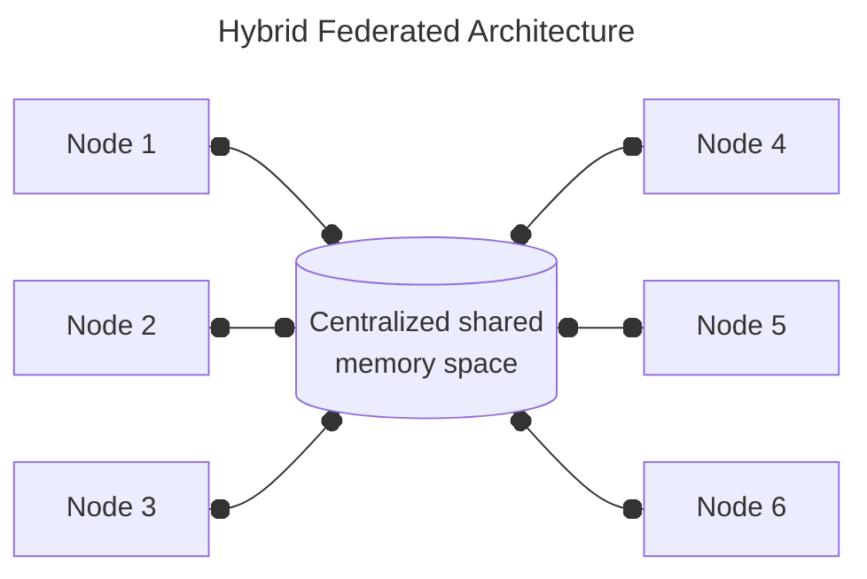
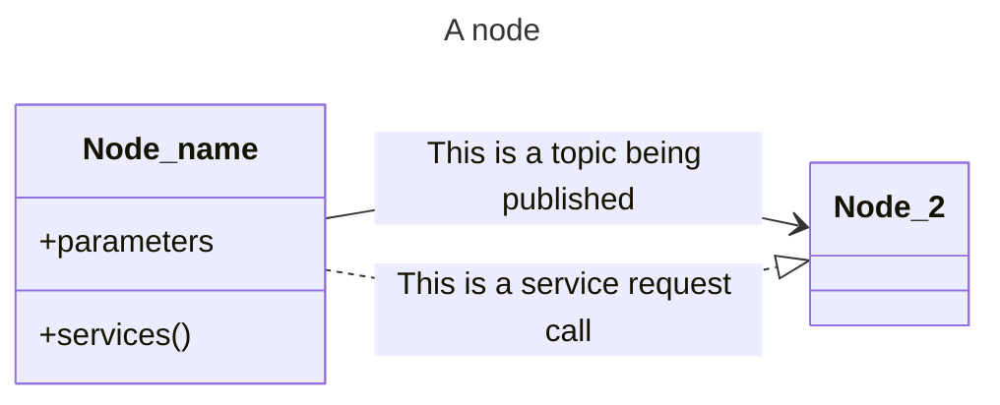
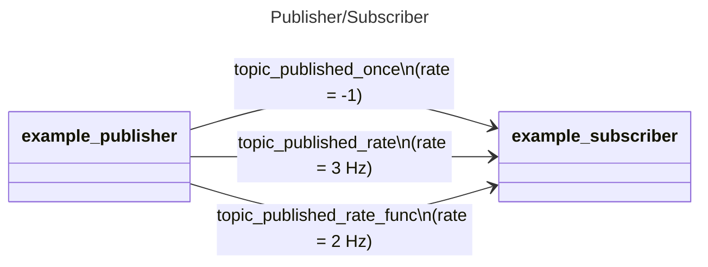
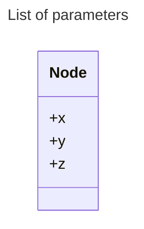
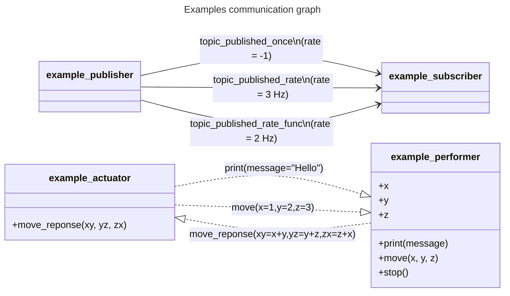
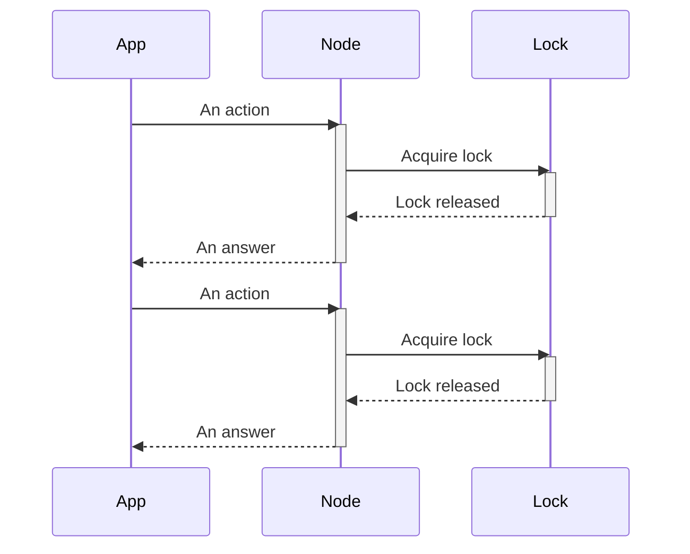
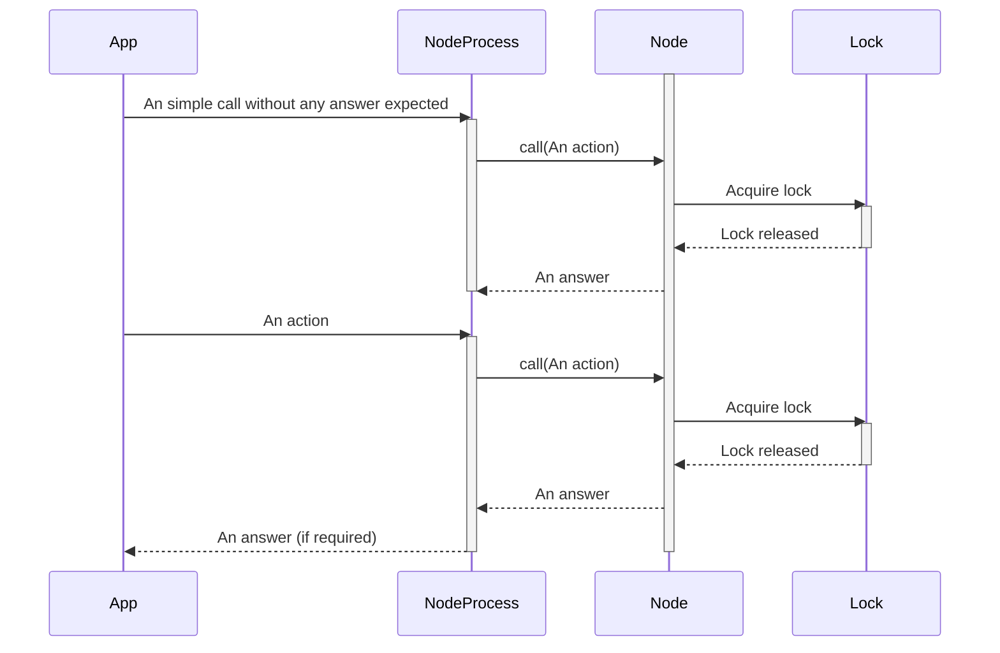

# AXONE

[](https://github.com/PYBrulin/axone/actions/workflows/pywheels.yaml)

Axone is a ROS-like framework for distributed computing on a local system implemented in pure-Python. It is designed to be used in a multi-process environment by using a shared memory for communication between nodes. No outside communication is supported at this time.

The package provide basic functionalities similar to ROS, such as:

- Publisher/Subscriber: A node can publish data to a topic, and other nodes can subscribe to this topic to receive the data.
- Service/Client: A node can provide a service, and other nodes can call this service.
- Parameter server: A node can store parameters on the parameter server, and other nodes can retrieve them.

## Installation

Axone can be installed locally using pip:

```bash
pip install -e .
```

or using the provided wheel in the [release](https://github.com/PYBrulin/axone/releases) section:

```bash
pip install axone-[version]-py3-none-any.whl
```

## Hybrid Federated Architecture

Axone nodes are designed to be run on a local system and on common **centralized memory space**. However, there is no central entity that is responsible to maintain either the main data structure, time or the distribution/communication of data between nodes (except maybe the OS itself if you consider it as a central entity).

By design nodes are responsible to maintain the main data structure without designating a main node. This is a design choice to keep the framework simple and to avoid the complexity of a distributed system. However, this design choice has some drawbacks. For example, if a node is killed, the data structure is not updated and the other nodes will not be aware of the change. To solve this issue, a **federation** mechanism is implemented.

To achieve federation, each node is able to validate the data structure periodically and to update the main structure if needed. Timestamp are the main mechanism to validate the data structure. Each node is responsible to update its own timestamp at a fixed rate of 1 Hz, otherwise the node is considered dead. Each node is also responsible to update the timestamp of the data structure it is responsible for. If a node detect that the timestamp of any data structure (topics, services, or even other node declarations) is older than a certain threshold, it will update the data structure appropriately, mostly by removing the outdated data structure. This mechanism is implemented in the `Node` class and is transparent to the user.

A requirement to use the federation mechanism is that the all nodes use the same package version. As the package is currently in development, this requirement is implied is the package is user-installed. However, if the package is installed in a virtual environment, data structure may break depending on the version of the package used.



## Usage



### Shared memory

Axone uses shared memory to communicate between nodes. A shared memory is created by the first node that uses it, and it is accessible by all nodes that use the same name.

The shared memory is identified by a name, and the size of the shared memory must be specified when creating it. The size of the shared memory is commonly a power of 2.

To handle concurrent access to the shared memory, Axone relies on a file lock to ensure that only one process can access the shared memory at a time. The file lock creation is handled by the cross-platform package `filelock` which is the only dependency of this project.

For more information on shared memory, see the [Python documentation](https://docs.python.org/3/library/multiprocessing.shared_memory.html).

```python
from axone.node import Node

node = Node(
    name="example_node", # Name of the node
    memory_endpoint="ExampleNodeMemory", # Name of the shared memory
    memory_size=4096, # Size of the shared memory
)
```

Note that for multiple nodes, it is also possible to load the network configuration from a file using the `load_network` method of the `Node` class. The method takes the path to the network configuration file as an argument. The network configuration file must be a JSON file with the following structure:

The JSON file defining the network configuration. Only the `memory_endpoint` and `memory_size` keys are required.

```json
{
  "memory_endpoint": "ExampleNodeMemory",
  "memory_size": 8192
}
```

The Python code to load the network configuration from the JSON file.

```python
from axone.node import Node

node = Node(
    name="example_node", # Name of the node
    config_file="axone.json", # The above JSON file
)
```

### Publisher/Subscriber



A publisher can be created using the `publish_rate` or `publish_once` method of a node. The method takes the name of the topic to publish to, and the data to publish. It is possible to pass a function as the message, in which case the function will be called at the rate specified by the `rate` argument. The function must return a JSON-serializable object as the message.

```python
from axone.node import Node

node = Node(
    name="example_publisher",
    memory_endpoint="ExampleNodeMemory",
    memory_size=4096,
)
node.publish_once(
    "topic_published_once",
    message={"data": "Hello from topic_published_once"},
)

def callable_function(self) -> None:
    return {"message": "Hello world!"}  # Must return a dictionary

node.publish_rate(
    "topic_published_rate_func",
    message=callable_function,
    rate=2,
)
```

A subscriber can be created using the `subscribe` method of a node. The method takes the name of the topic to subscribe to, and a callable callback function that will be called when a message is received. The callback function must take a single argument, which will be the received message. Parsing of the message should be handled by the callback function.

```python
from axone.node import Node

node = Node(
    name="example_subscriber",
    memory_endpoint="ExampleNodeMemory",
    memory_size=4096,
)

def callback(message):
    print(f"Raw object: {message}")
    print(f"Data within: {message.get('data')}")

node.subscribe("topic_published_once", callback=callback)
```

### Service: Request/Response


A list of services or services can be registered by a node during initialization. The list of services is passed as a dictionary to the `services` argument of the `Node` constructor. The dictionary must have the service name as the key or be passed a callable function directly. The value of each key must be a dictionary with the name of the arguments as the key and the type of the argument as the value. The callable function must take a single argument, which will be the request message.

```python
from axone.node import Node

def display(message):
    print(f"Message: {message.get('message')}")

def move(message):
    print(
        f"Moving to: {message.get('x')}, {message.get('y')}, {message.get('z')}"
    )

node = Node(
    name="example_performer",
    memory_endpoint="ExampleNodeMemory",
    memory_size=4096,
    services={
        display: {
            "message": "str",
        },
        move: {
            "x": "float",
            "y": "float",
            "z": "float",
        },
    },
)
```

A service can be called using the `call_service` method of a node. The method takes the name of the service to call, the name of the service to call, and the arguments to pass to the service directly as keyword arguments.

```python
from axone.node import Node

node = Node(
    name="example_actuator",
    memory_endpoint="ExampleNodeMemory",
    memory_size=4096,
)
node.call_service(dest_node=target_node, service="move", x=1, y=2, z=3)
```

An answer can be returned by a service, but is not required. The answer must be a JSON-serializable object.
If an answer is expected, the argument `answer` can be passed to the `call_service` method.
The `answer` argument accept either a string matching the service name, or directly the callable function to call. The callable function must already be registered as an service on the client node and must take the same arguments as the response message will have. On the service side, the answer will be returned on the service named after `answer`. If no `answer` argument is passed, but the service still returns an answer, the answer will be ignored. For an example of this, see the `example_actuator` and `example_performer` nodes in the `examples` folder which implement a simple request/response service over the request `move` and the response `move_response`.

### Parameter server



A parameter list can be exposed by a node during the node initialization. The list of parameters is passed as a dictionary to the `parameters` argument of the `Node` constructor. The dictionary must have the parameter name as the key and the value of the parameter as the value. The value of each key must be a JSON-serializable object.

These parameters are read-only and cannot be modified by external node. If a behavior is expected to perform changes to the parameters, it should be implemented as a service. An example of this is the `example_performer` node in the `examples` folder which implicitly implements the simple service `move` which updates the value of the parameters `x`, `y` and `z`.

```python
from axone.node import Node

x = y = z = 0
node = Node(
    name="example_performer",
    memory_endpoint="ExampleNodeMemory",
    memory_size=4096,
    parameters={
        "x": x,
        "y": y,
        "z": z,
    },
)
```

### Examples

The `examples` folder contains a few examples of nodes that can be run using the `axone` command.
When running all `example_*.py` files, the following communication graph is created:



## Standalone Process

Accessing and releasing the lock on the shared memory can be costly, especially if the shared memory is accessed at a high rate. To avoid this, it is possible to run the node in a standalone process. In this case, the node will exist in its own process. However, there is currently some ongoing limitation to this approach:

- Subscribers callbacks will not be called as the node is not running in the main process and the reference to the callback is lost.
- Services can be called but cannot be answered as the node is not running in the main process and the reference to the answer callback is lost.

Advantages of running a node in a standalone process comes mainly on the underlying memory management. As the node is running in its own process, the memory is managed without impacting the main process "too much". This is especially useful when using a large shared memory or when the main process is speed-critical where accessing and releasing the lock on the shared memory can be a bottleneck.

Using a simple Node:



Using a NodeProcess:


